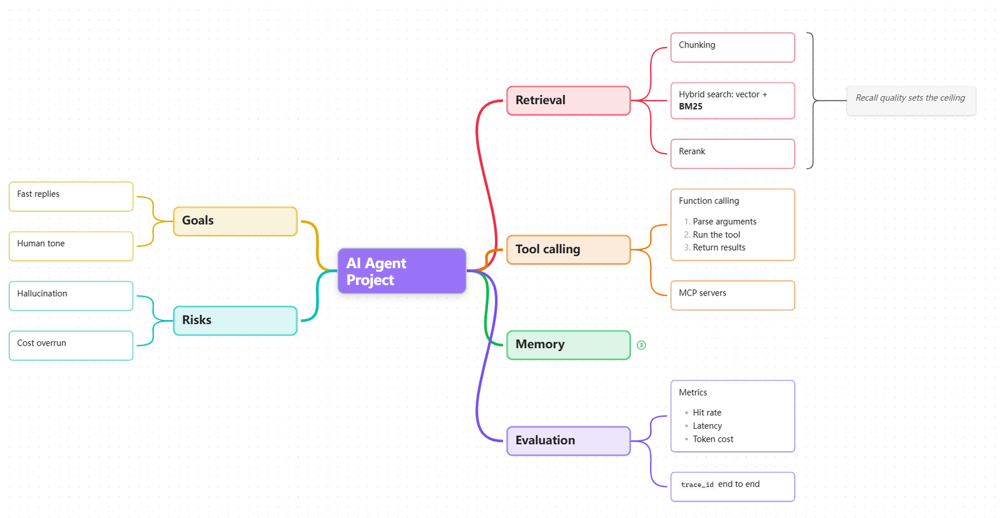
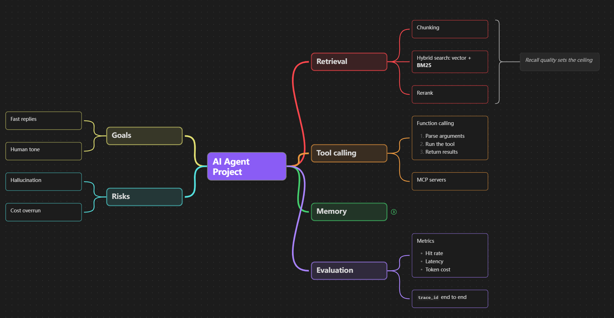
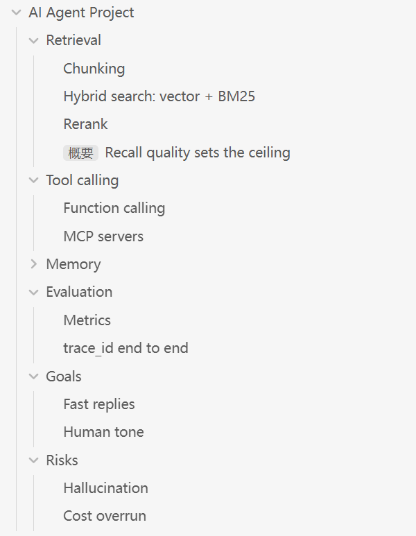

# Cammvas Plus

**XMind-style mind mapping inside Obsidian Canvas.**

  

Cammvas Plus adds the interactions people expect from standalone mind-mapping software while keeping every map as a standard `.canvas` file in the vault. Build branches from the keyboard, drag nodes onto other nodes to restructure a map, collapse subtrees, summarize sibling ranges, and navigate the hierarchy without leaving Canvas.

## Features

- **Mind-map keyboard workflow:** outside editing, tap `Space` to edit the selected node (hold `Space` and drag to pan), `Enter` creates a sibling, `Tab` creates a child, and arrow keys navigate the tree. Editing starts with the cursor at the end of the text.
- **Drag to reparent:** drop one or more nodes onto another node to move their complete branches; the dragged cards fade so the highlighted target stays visible.
- **Collapsible branches:** fold and restore subtrees from a small dot on the branch line; collapsed branches show how many nodes they hide, and expanding glides siblings into place.
- **Summaries (概要):** select adjacent siblings and choose **Create summary** to add a curly brace and a summary topic, like XMind. Summaries follow their range through layout, collapse, and export, and clean themselves up when their range is deleted.
- **Automatic tree layout:** left, right, and balanced branches, horizontal or vertical. The viewport stays anchored while the map reflows, so the node you are looking at does not jump.
- **Visual hierarchy:** accent root, tinted main branches, outlined deeper topics, and link widths by depth, in light and dark themes.
- **Manual sizes respected:** a height you drag by hand is kept; **Resize all nodes to fit content** returns nodes to automatic sizing.
- **Map outline:** search, navigate, group, and rename roots from a sidebar that follows collapse state and lists summaries under their parent.
- **PDF export:** vector PDF of the whole map, including summary braces.
- **Robust graphs:** edge cycles and nodes with several parents no longer break layout.
- **Localized:** the interface follows Obsidian's language (English and Chinese).
- **Canvas-native storage:** no proprietary format, external service, network request, or telemetry.

## Quick Start

1. Open a Canvas, click the **mind map** button in the Canvas controls, and make sure **Mindmap mode** is checked.
2. Right-click empty Canvas space and choose **Create root node**.
3. Select a node and press `Enter` / `Tab` to add sibling and child nodes; tap `Space` to edit and press `Escape` to finish.
4. Drag nodes onto other nodes to restructure branches, and use the dot beside a node to collapse or expand it.
5. Select two or more adjacent siblings, right-click, and choose **Create summary**.

The mind map button menu also toggles **Drag to reparent**, **Auto-layout on manual edits**, and **Mind mapping Enter and Tab**, switches between horizontal and vertical layout, exports a PDF, and opens the outline. All behavior can be configured under **Settings > Cammvas Plus**.

## Keyboard Workflow

| Key (outside editing) | Action |
| --- | --- |
| Tap `Space` | Edit the selected node, cursor at the end |
| Hold `Space` + drag | Pan the canvas |
| `Enter` | Add a sibling (on a summary: edit it) |
| `Tab` | Add a child |
| Arrow keys | Move between parent, children, and siblings |
| `Escape` (while editing) | Finish editing |

Outside editing, tap `Space` to edit the selected node; holding `Space` keeps Canvas's pan gesture. While editing, `Space`, `Enter`, and `Tab` stay with the text editor; press `Escape` or click outside the node to finish. Outside editing, plain `Enter` creates a sibling, plain `Tab` creates a child, and arrow keys navigate between nodes. `Enter` on a summary edits it.

Cammvas Plus assigns no default hotkeys. Useful commands to bind under **Settings > Hotkeys** include **Toggle selected branch**, **Create summary from selected siblings**, **Add child node**, and **Add sibling node**.

## Screenshots

**Dark theme** — the hierarchy uses your theme's colors:

**Map outline** — follows collapse state and lists each summary under its parent:

## Data Stored In Canvas Files

Everything stays inside the `.canvas` file so maps remain portable:

- `mindmap` — whether the canvas uses mind map mode (only written when toggled).
- `mindmapCollapsed` — IDs of collapsed nodes.
- `cammvasSummaries` — summary ranges; each summary is drawn with an ordinary group node (the brace) and text node (the topic), so the file still opens in plain Canvas.
- `cammvasMinHeight` on a node — a height chosen by hand.

## 中文简介

Cammvas Plus 让 Obsidian 白板（Canvas）像 XMind 一样做思维导图：Enter/Tab 建节点、点按空格编辑、拖拽改父节点、折叠展开带动画、XMind 式“概要”（花括号）、自动排版且视角不乱跳、层级配色、大纲同步、PDF 导出。所有数据都保存在标准 `.canvas` 文件中，界面会跟随 Obsidian 语言显示中文。

## Installation

### Community Plugins

Once Cammvas Plus is accepted into the Obsidian community directory:

1. Open **Settings > Community plugins**.
2. Search for **Cammvas Plus**.
3. Select **Install**, then **Enable**.

### Manual Installation

1. Download `main.js`, `manifest.json`, and `styles.css` from the [latest release](https://github.com/epiphany-li/cammvas-plus/releases/latest).
2. Create `.obsidian/plugins/cammvas-plus/` inside the vault.
3. Place the three files in that folder.
4. Enable Cammvas Plus under **Settings > Community plugins**.

## Compatibility

Cammvas Plus requires Obsidian 1.13.4 or newer. Desktop and mobile use the same Canvas files and core mind-mapping features. On mobile, long-press and drag a node to reparent it; mouse- and modifier-specific interactions remain desktop-only. Several advanced Canvas interactions depend on undocumented runtime APIs, so compatibility is tested against current Obsidian releases.

## Privacy And Permissions

Cammvas Plus runs locally, makes no network requests, and collects no telemetry. It writes Canvas changes through Obsidian's vault API. Clipboard access occurs only after an explicit **Copy node link** action and writes the generated `obsidian://cammvas-plus-navigate` link to the clipboard; Cammvas Plus never reads clipboard contents.

## Origin And Attribution

Cammvas Plus is maintained by [epiphany-li](https://github.com/epiphany-li) as a derivative of [Cammvas](https://github.com/cuatrecasespro/cammvas), developed by cuatrecasespro. Cammvas is based on the MIT-licensed [Mindvas](https://github.com/mobench/mindvas) project by mobench; all copyright and license notices are retained.

Cammvas extends that foundation with a workflow designed to reproduce dedicated mind-mapping software inside Canvas, including drag-to-reparent branch creation, persistent branch collapsing, conventional mind-map hotkeys, spatial navigation, configurable branch palettes, root creation, and an expanded synchronized outline. Cammvas Plus adds summaries, animated collapse, viewport-stable layout, visual hierarchy, manual sizing, graph robustness, and localization on top of Cammvas.

Cammvas is not affiliated with or endorsed by the original Mindvas project.

## License

[MIT](LICENSE). See the license file for the original and current copyright notices.

## Contributing

Bug reports and feature requests are welcome in the [issue tracker](https://github.com/epiphany-li/cammvas-plus/issues).
